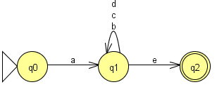

# AFD Exercício 3

Implementação java recursivo de um Autômato Finito Determinístico(AFD) que reconhece a linguagem:

L = {w &isin; {a,b}* | w possui o prefixo a uma quantidade qualquer de b ou c ou d e o sufixo com e}
- Ex.: abe, ace, ade, abbe, acce, adde, .... 

Definição da linguagem:
- L = <{a, b}, {s0, s1, s2}, s0, δ, {s2}>, 
- onde δ é:
    - δ{s0,a) = s1 
	- δ{s1,b) = s1
	- δ{s1,c) = s1
	- δ{s1,d) = s1
	- δ{s1,e) = s2

AFD:

Arquivo JFlap:
[AFD_ex3_v1.jff](AFD_ex3_v1.jff)